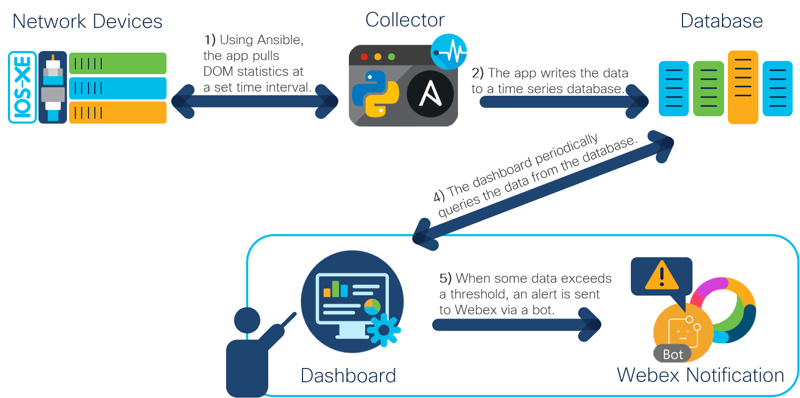
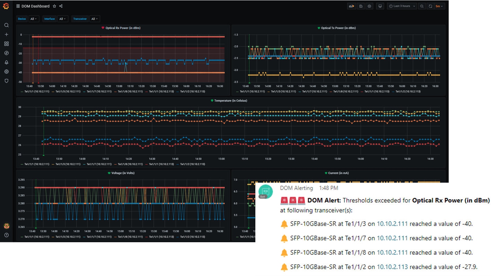

# Digital Optical Monitoring (DOM) Telemetry Application

A containerized application that periodically evaluates the condition of fiber connections in a network by collecting DOM statistics from transceiver modules installed on Cisco IOS-XE devices and visualizing the data in a dashboard, incl. sending alerts via a Webex bot ([watch demo](https://youtu.be/FvAWvsVMPds)). The information can be used for predictive maintenance of fiber connections.  

## Application Workflow
 

**Digital Optical Monitoring**: DOM is an industry-wide standard that allows you to collect operating paramaters of transceiver modules* in real time. The collected values are:
* **Optical Transmit (Tx) power**, measured in decibels (milliwatts)
* **Optical Receive (Rx) power**, measured in decibels (milliwatts)
* **Laser bias current**, measured in milliamperes
* **Temperature**, measured in celsius
* **Transceiver supply voltage**, measured in volts 

*Which Cisco transceivers support DOM can be found in the [compatibility matrix tool](https://tmgmatrix.cisco.com/). For more information on how to use DOM, go [here](https://community.cisco.com/t5/networking-documents/digital-optical-monitoring-dom/ta-p/3120342).

**Telemetry Application**: Telemetry is used to gather operational statistics on what is going on in the network. Based on that information collected over a period of time, organizations can gain much deeper visibility into their environment, which can help them to proactively manage possible and potential issues and to make better-informed business decisions on their IT infrastructure. Collecting DOM statistics, especially from larger networks, can thereby provide insights into the status of fiber connections, based on which trend analyses can be made to proactively identify where and why issues may occur before links actually go down. The telemetry application for this use case consists of three services:

- **Collector**: Using Ansible, a Python script periodically pulls DOM statistics from Cisco IOS-XE devices. The data is then prepared and written to the database.  
  - The reason data in this use case is being pulled rather than pushed from the devices, as it is the case with [streaming/model-driven telemetry](https://blogs.cisco.com/developer/model-driven-telemetry-sandbox?dtid=osscdc000283), is that the IOS-XE YANG model does not contain a module for optics operational data yet (NB: this [module](https://github.com/YangModels/yang/blob/master/vendor/cisco/xr/721/Cisco-IOS-XR-controller-optics-oper.yang) exists for IOS-XR devices).
- **Time-Series Database**: Since data is periodically collected at set time intervals, the data is stored in a time-series database that is optimized for time-stamped data. In this use case, the open-source database [InfluxDB](https://www.influxdata.com/products/influxdb/) is implemented.  
- **Visualization and Alerting**: The data is visualized in a monitoring and analytics dashboard using the open-source platform [Grafana](https://grafana.com/). Through a webhook configuration, this platform also triggers alerts in case some data exceeds a certain threshold. In that case, a notification is sent to a Webex room using a [Webex bot](https://developer.webex.com/docs/bots) to inform about the alert.

 

### Application Setup
The application is split into 3 Docker containers, which are configured and started using the `docker-compose.yaml` file:

 **InfluxDB**:
  * based on the official Docker image: https://hub.docker.com/_/influxdb

 **Grafana**:
  * based on the official Docker image: https://hub.docker.com/r/grafana/grafana/
  * upon start configures InfluxDB as data source and creates default dashboard
  * periodically queries data from InfluxDB 
  * sends alerts when data thresholds are exceeded via webhook to Webex
  
 **Setup and Collector**:
  * Python application
  * upon start deploys Webex bot to Heroku and configures webhook notification channel in Grafana
  * periodically collects DOM statistics from IOS-XE devices at a set time interval (60 seconds by default) using Ansible and writes that data to InfluxDB
  * upon start and periodically after collects transceiver information per interface and their alarm and warning thresholds using Ansible to update variables, queries, and alerts in Grafana

## Contacts
* Jara Osterfeld (josterfe@cisco.com)

## Solution Components
* Docker
* Python
* Ansible
* InfluxDB
* Grafana
* Cisco IOS-XE
* Webex bot hosted on Heroku

## Prerequisites
- **Docker**: If you do not have Docker installed, you can download it [here](https://docs.docker.com/get-docker/).
- **Notifier Bot**:
    - **Webex**:
      - **Account**: If you do not have a Webex account yet, you can create one [here](https://cart.webex.com/sign-up-webex) for free.
      - **Create a Bot**:
         1. Go to the [Webex Developer website](https://developer.webex.com/docs/bots) to create a bot.
         2. Log in with your Webex credentials by clicking **Log in** on the top right corner.
         3. Click **Create a Bot**.
         4. Fill in the information for your new bot, and click **Add Bot** at the bottom of the page.
         5. On the next page, you will see your **Bot Access Token**. Copy the token and save it as it will not be shown again.
      - **Dedicated Team Space and Room ID**:
         1. Create a Webex Teams Space to send alerts to by following [these instructions](https://help.webex.com/en-us/hk71r4/Webex-Teams-Create-a-Space).
         2. Name the space.
         3. Add the bot to the space. Also add other users that should receive the bot notifications.
         4. Click **Create**.
         5. Go to the [Webex API documentation for Webex Teams Rooms](https://developer.webex.com/docs/api/v1/rooms/list-rooms) to retrieve the ID.
         6. Use the interactive API endpoint on the right of the page. Use your personal access token (enabled by default) and if you just created the space, you can use the query parameter *sortBy* with the value *created* to list that space as the first entry in the response. Click **Run** and note the *id* value for the space you just created from the returned response below the request.
    - **Heroku**: If you do not have a Heroku account yet, [click here](https://signup.heroku.com/dc) to sign up for free.

## Installation

1. Clone this repository with `git clone <this repo>`.

2. Navigate to the `app-code` directory and take the following actions: 
    - Open the `credentials.yaml` file and add the following information:
    
            heroku_username: '' # Heroku username
            heroku_password: '' # Heroku password
            heroku_region: '' # either 'eu' for Europe or 'us' for USA
            webex_bot_token: '' # bot access token retrieved when Webex bot was created (see Prerequisites section)
            webex_room_id: '' # room ID of dedicated Webex Teams space (see Prerequisites section)
            
         All other information in the file can be left unchanged.
         
    - Navigate to the `inventory` directory, open the `hosts` file, and add the following information:
    
            [dom] 
            # add the IP addresses of the IOS-XE devices to pull DOM statistics from
            # for each IP address, use a new line
            
            [dom:vars]
            ansible_user= # add the username to use when authenticating to the devices
            ansible_password= # add the password associated to the username
            ansible_become_pass= # add the privilege escalation password 

3. In a terminal, navigate to the root directory, in which the `docker-compose.yaml` file is located and issue the command `docker-compose up` to start the containerized application. When starting the application for the first time, this can take a few minutes. 

## Operations
- **Data Collection**: By default, DOM statistics are collected and written to the database every 60 seconds, and transceiver information per interface, incl. alert thresholds, are updated upon application start and every 1440th iteration of data collection, i.e. approx. every 24 hours (60 seconds x 1440 = 24 h).
   - To customize these values, change the following variables in the `app-code/credentials.yaml` file:
   
         collector_interval: 60 
         transceiver_update_interval: 1440
- **Dashboard**: In a browser, navigate to Grafana, which you can find at port `3000` of the IP address of the server the containers are running on (i.e. `<host-IP>:3000`). Log in with `admin` as username and password, and open the dashboard called *DOM Dashboard*. 
   - By default, the different panels in the dashboard show data collected over the past 3 hours and it automatically updates every 5 minutes by querying InfluxDB for new data points. This can be changed in the top right corner of the dashboard.
   - You can filter on *Device*, *Interface*, and *Transceiver* in the top left corner of the dashboard.
   - Red horizontal lines in the different graphs visualize threshold levels for the data, which is linked to different alert conditions.
   - The dashboard can be customized (see [instructions](https://grafana.com/docs/grafana/latest/panels/)) and new ones added (see [instructions](https://grafana.com/docs/grafana/latest/dashboards/)) for different use cases.
      - Note that when you stop the Grafana container and re-start it, changes in the default dashboard and newly created ones are not saved automatically. To make them persistent, you need to update the `dom_dashboard.json` file in the `grafana/dashboards` directory with the updated model and/or add a second `.json` file for a new dashboard in the same directory. This also applies to changes made to alerts using the Grafana dashboard. Instructions on how to retrieve a json model of a dashboard can be found [here](https://grafana.com/docs/grafana/latest/dashboards/json-model/).
- **Alerting**: Alerts are automatically configured and sent to Webex.
  - To view configured alerts and their status in Grafana, navigate to *Alerting* > *Alert Rules*. Click on the different alerts for details.
  - With the default alert rule and condition, an alert is triggered if the average of the data points collected over the past 5 minutes for an interface falls outside of the configured range for its transceiver for 5 minutes in a row.  
    - Threshold levels are defined as a range of a higher and a lower alert value and differ per transceiver module per DOM value collected. Since he data is collected automatically, these should not be changed or customized.
    - By default, alert conditions evaluate whether the average of the data collected in the past 5 minutes (now - 5 min) lies outside the configured threshold range. These conditions are by default checked every minute and an alert is sent if a condition is violated for longer than 5 minutes. 
      - To customize these values, change the following variables in the `app-code/credentials.yaml` file: 
     
             grafana_alert_for: '5m'
             grafana_alert_frequency: '1m'
             grafana_alertcondition_aggregation: 'avg'
             grafana_alertcondition_time1: '5m'
             grafana_alertcondition_time2: 'now'
           
           You can find a more detailed explanation of alert rules and conditions [here](https://grafana.com/docs/grafana/latest/alerting/create-alerts/).
      - Alert rules and conditions should be customized and adapted for different scenarios and use cases. For example, if you change the `collector_interval` variable from `60` to `43200` seconds (12 hours), adapting the default alert rule and condition to longer intervals and time spans would make sense.
    - By default, an alert is re-sent after 30 minutes if an alert condition is still being violated.
      - To customize the frequency, change the following variable in the `app-code/credentials.yaml` file:
        
             grafana_notificationchannel_reminder: '30m'
   - The source code of the bot that is used to send alerts to Webex is hosted [here](https://www.github.com/gve-sw/DOM-Telemetry_bot). To use another bot, change the following variables in the `app-code/credentials.yaml` file to the new hosting location:
           
         heroku_sourceblob_url: 'https://www.github.com/gve-sw/DOM-Telemetry_bot'
         heroku_sourceblob_version: 'master'

## License
Provided under Cisco Sample Code License, for details see [LICENSE](./LICENSE.md).

## Code of Conduct
Our code of conduct is available [here](./CODE_OF_CONDUCT.md).

## Contributing
See our contributing guidelines [here](./CONTRIBUTING.md).